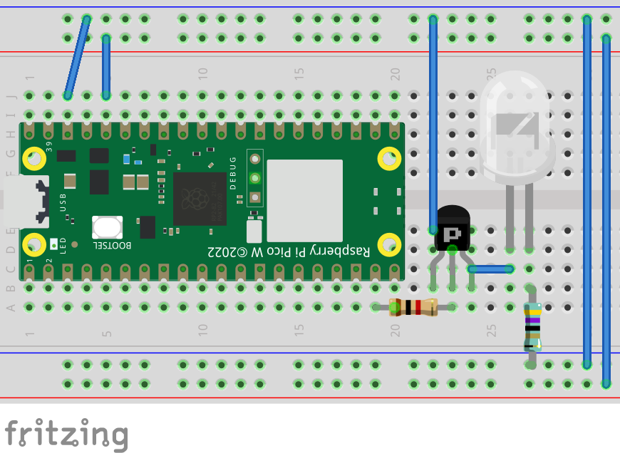

# rpi-pico-ac-control

Raspberry pi pico program for controlling Mitsubishi Heavy A/C[^1] with a website interface and from Home Assistant (with mqtt).
[^1]: support only for 152 bit protocol used in RLA502A700B / RLA502A700L / RLA502A704 (may work with other too).

## Setting up

### Required materials

| _Item_                 | _Quantity_ | Details                                                                  |
| ---------------------- | ---------- | ------------------------------------------------------------------------ |
| Raspberry Pi Pico W    | 1          | https://www.raspberrypi.com/products/raspberry-pi-pico/                  |
| 940nm Infra-Red LED          | 1          | dgeneric part                        |
| 1000 ohm 1/4W resistor | 1          | generic part                                                             |
| 37 ohm 1W resistor     | 1          | Please calcualte this value yourself, it depends on what IR LED you have |
| npm transistor         | 1          | I used 2N3904                                                            |

### Running the code

1. Make sure pico C sdk is installed
2. Define wifi SSID and password in `secrets/secrets.pass`, here you can also provide mqtt user and password
3. In `config.cmake` define gpio pin for IR LED control, default one is like on the diagram above.
4. (Optional) Home Assistant mqtt integration. In `config.cmake` set `MQTT_ENABLED` to 1 and define channels to listen to. Those names correspond to topics defined in your home assistant climate configuration (example configuration in `home_assistant_configuration.yaml`)
5. Configure cmake and run with `cmake -B./build && cd build && make`
6. Flash generated `ac-control.uf2` to your pico W.
7. If after flashing the onboard LED turned on then after a short while blinked few times it means configuration was sucessful and you should see web interface.

| Feature            | Web | Home Assistant |
| ------------------ | --- | -------------- |
| Temperature Change | ✅  | ✅             |
| Mode Change        | ✅  | ✅             |
| Basic Fan Modes    | ✅  | ✅             |
| Advanced Fan Modes | ✅  | ❌             |
| Sleep and Silent   | ✅  | ❌             |
| Presets            | ❌  | ❌             |
